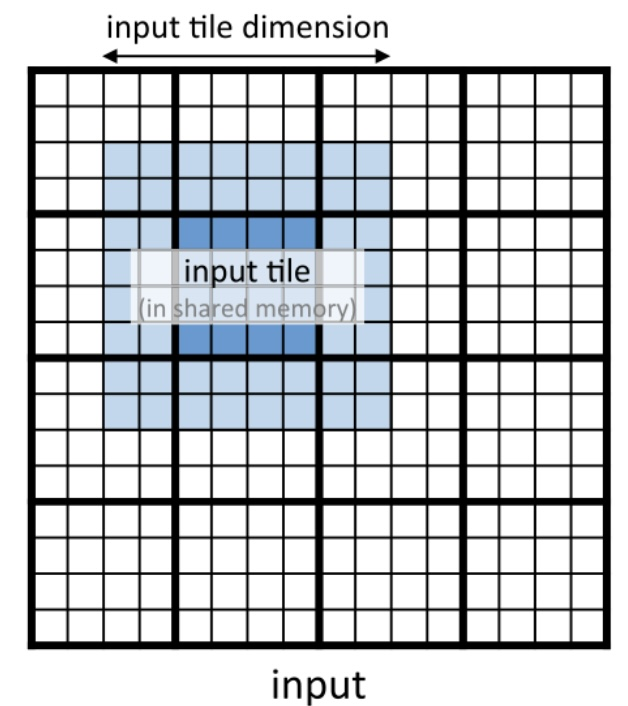
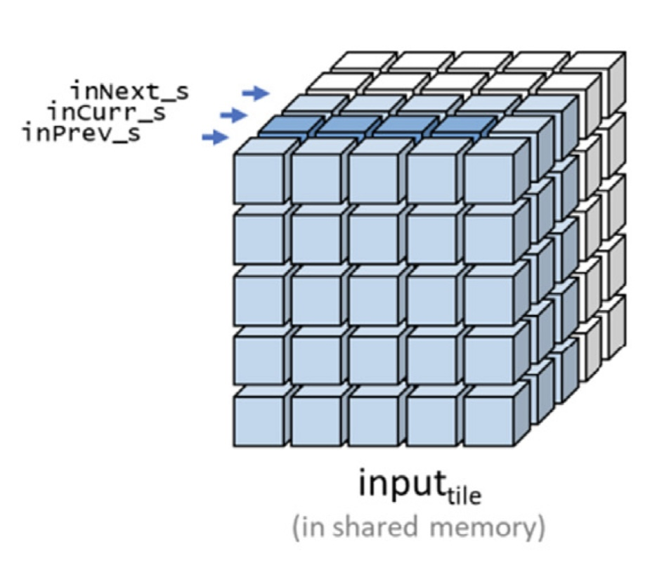

+++
title = 'Conway'
date = 2024-06-29T12:40:21+08:00
draft = true
categories = ["CUDA"]
tags = ["CUDA", "HPC", "Optimization", "SIMD", "Shared Memory"]
+++
# 3D Conway's Game of Life using CUDA.

今年HPCGame出了一道CUDA题，要求模拟3D康威生命游戏。

康威生命游戏是英国数学家约翰・何顿・康威在1970年发明的细胞自动机。在初始版本的生命游戏中，世界是一个二维的方格矩阵，其中，每个方格中居住着存活或者死亡的细胞。一个细胞在下一时刻的生死取决于相邻的八个方块中居住的存活或者死亡的细胞的数量。

而3D版本的康威生命游戏的状态转移规则如下：

- 当细胞为存活状态时
  - 如果周围存活的细胞低于5个（不包含5个）时，细胞变为死亡状态
  - 如果周围存活的细胞有5到7个时（包含5和7），则细胞保持存活
  - 如果周围存活的细胞超过7个（不包括7个）时，细胞变为死亡状态
- 当细胞为死亡状态时
  - 如果周围有6个存活细胞时，该细胞变成存活状态

同时我们希望研究无限空间大小下的生命游戏。但是，无限空间难以在计算机中表示，因此，我们采取一种”循环“的策略，来模拟无限空间。具体规则为：若有效信息的块的边长为$M$，则无限空间中任意一点$(x, y, z)$对应有效信息块中的位置为$(x \mod M, y \mod M, z \mod M)$。

> 看到这个题目的计算模式，大家可能很容易想到convolution和stencil这两个经典计算模式，都是需要目标元素的周围若干元素来完成目标元素的计算。在优化时，也可以借鉴这两个计算模式的优化技巧。

## Basic implementation
先仿照baseline代码写个最基本的cuda实现，很容易就搓出来了下面的代码：

```cpp
__global__ void conway_step(uint8_t *curr_space, uint8_t *next_space, size_t M) {

  int i = blockDim.z * blockIdx.z + threadIdx.z;
  int j = blockDim.y * blockIdx.y + threadIdx.y;
  int k = blockDim.x * blockIdx.x + threadIdx.x;

  int li = (i + M - 1) % M * M * M;
  int mi = i * M * M;
  int ri = (i + 1) % M * M * M;

  int lj = (j + M - 1) % M * M;
  int mj = j * M;
  int rj = (j + 1) % M * M;

  int lk = (k + M - 1) % M;
  int mk = k;
  int rk = (k + 1) % M;

  uint8_t curr_state = curr_space[mi + mj + mk];
  uint8_t &next_state = next_space[mi + mj + mk];

  uint8_t neighbor_count = curr_space[li + lj + lk] + curr_space[li + lj + mk] +
                          curr_space[li + lj + rk] + curr_space[li + mj + lk] +
                          curr_space[li + mj + mk] + curr_space[li + mj + rk] +
                          curr_space[li + rj + lk] + curr_space[li + rj + mk] +
                          curr_space[li + rj + rk] + curr_space[mi + lj + lk] +
                          curr_space[mi + lj + mk] + curr_space[mi + lj + rk] +
                          curr_space[mi + mj + lk] + curr_space[mi + mj + rk] +
                          curr_space[mi + rj + lk] + curr_space[mi + rj + mk] +
                          curr_space[mi + rj + rk] + curr_space[ri + lj + lk] +
                          curr_space[ri + lj + mk] + curr_space[ri + lj + rk] +
                          curr_space[ri + mj + lk] + curr_space[ri + mj + mk] +
                          curr_space[ri + mj + rk] + curr_space[ri + rj + lk] +
                          curr_space[ri + rj + mk] + curr_space[ri + rj + rk];

  if(curr_state == 1) {
    if(neighbor_count < 5 || neighbor_count > 7) next_state = 0;
    else next_state = 1;
  }
  else {
    if(neighbor_count == 6) next_state = 1;
    else next_state = 0;
  }

}
```

先计算单个thread需要计算的细胞对应的index，随后访问对应细胞的时生存状态并求和。
> 小提示：注意计算index时i，j，k分别对应的z，y，x方向，若是反了的话，虽然也能得到正确结果，但是性能会很差。

可以看到这个毫无技巧可言的cuda kernel存在的几个主要的性能问题。
- 存在大量对global memory的访问，arithmetic intensity（the arithmetic to global memory access ratio）较低（约0.23）。
- 计算目标细胞的周围存活细胞数量时，存在大量的计算。

## Shared Memory

针对第一个问题，需要用到学过CUDA的都知道的**shared memory**了。但是那么大的一个3维矩阵，小小shared memory肯定塞不下，此时就需要进行shared memory tiling，对3维矩阵进行分块。

> 小知识：shared memory是NVIDIA GPU上的一类内存，有效地使用shared memory可以显著提升计算密度（arithmetic intensity），减少global memory的访问次数。

一个非常直观的划分方式就是一个block负责与该block维度相同的input tile，每个thread对应一个单元（细胞），并负责将其load到shared memory中。该input tile最外面的一层（halo region）在该block中仅当作输入，即对应的thread并不计算该单元在下一个迭代中的存活情况。分块方式类似下面图片所示（图片仅展示了2维矩阵，3维类似，且该题中单方向的halo region为1个单元，而图片为2个）：



因此需要分配一个与block大小相同的3维shared memory，之后的计算类似上面的基本实现。假设block维度是16 x 8 x 8 = 1024，那么shared memory的大小也应为1024，其中，最外面的一层thread仅负责将halo region的单元load到shared memory中，即在最终的计算过程中，这些线程保持idle。因此最终仅有（15 x 7 x 7）/ 1024 = 71.8% 的参与output tile 的运算。另一方面，单个warp的32个线程需要从2个地方load输入数据，无法进行memory coalesce。

> 小知识：shared memory早在NVIDIA Tesla架构就存在了，在Volta架构及之后，NVIDIA便将L1 data cache 和 shared memory结合了起来（物理结合）并延续至今（之所以强调延续至今，是因为在Volta架构之前L1 data cache和shared memory经历过分而复合，合而复分的爱恨情仇），简化了编程和优化的复杂度，同时提升了性能。在V100中，单个SM中的L1 data cache和shared memory共占128KB，而在A100中，这个数值提升到了192KB。在程序中可以通过`cudaFuncSetAttribute()`动态调整shared memory的大小。

因为单个细胞的计算只需用到邻近的26个细胞，因此可以把3维的block转化为xy平面的2维block，其中每个block中的thread依次将z方向上所需要的细胞load到shared memory中并进行计算，下图为第2次迭代时shared memory和input tile的对应情况。


每个block沿着z方向进行迭代，迭代次数`Z_ITER`可根据实际情况进行微调。
该版本的代码如下所示：

```cpp
__global__ void conway_step(uint8_t *curr_space, uint8_t *next_space, size_t M) {
  __shared__ uint8_t curr_space_fro_s[INPUT_TILE][INPUT_TILE];
  __shared__ uint8_t curr_space_mid_s[INPUT_TILE][INPUT_TILE];
  __shared__ uint8_t curr_space_end_s[INPUT_TILE][INPUT_TILE];

  int tx = threadIdx.x;
  int ty = threadIdx.y;

  int iStart = Z_ITER * blockIdx.z; // the start index of the output_tile in z axis.
  int j = OUTPUT_TILE * blockIdx.y + ty - 1;
  int k = OUTPUT_TILE * blockIdx.x + tx - 1;

  int mj_k = ((j + M) % M) * M + (k + M) % M; 
  int M2 = M * M;
 
  curr_space_fro_s[ty][tx] = curr_space[((iStart + M - 1) % M) * M2 + mj_k];
  curr_space_mid_s[ty][tx] = curr_space[iStart * M2 + mj_k];

  for(int i = iStart; i < iStart + Z_ITER; i++) {
    curr_space_end_s[ty][tx] = curr_space[((i + 1) % M) * M2 + mj_k];

    __syncthreads();

    if((unsigned int)(i - 0) < M && (unsigned int)(j - 0) < M && (unsigned int)(k - 0) < M && 
       (unsigned int)(tx - 1) < INPUT_TILE - 2 && (unsigned int)(ty - 1) < INPUT_TILE - 2 ) {
        uint8_t neighbor_count = curr_space_mid_s[ty - 1][tx - 1] + curr_space_mid_s[ty - 1][tx]
                               + curr_space_mid_s[ty - 1][tx + 1] + curr_space_mid_s[ty][tx - 1]
                               + curr_space_mid_s[ty][tx + 1] + curr_space_mid_s[ty + 1][tx - 1]
                               + curr_space_mid_s[ty + 1][tx] + curr_space_mid_s[ty + 1][tx + 1]
                               + curr_space_fro_s[ty - 1][tx - 1] + curr_space_fro_s[ty - 1][tx]
                               + curr_space_fro_s[ty - 1][tx + 1] + curr_space_fro_s[ty][tx - 1]
                               + curr_space_fro_s[ty][tx] + curr_space_fro_s[ty][tx + 1]
                               + curr_space_fro_s[ty + 1][tx - 1] + curr_space_fro_s[ty + 1][tx]
                               + curr_space_fro_s[ty + 1][tx + 1] + curr_space_end_s[ty - 1][tx - 1]
                               + curr_space_end_s[ty - 1][tx] + curr_space_end_s[ty - 1][tx + 1]
                               + curr_space_end_s[ty][tx - 1] + curr_space_end_s[ty][tx]
                               + curr_space_end_s[ty][tx + 1] + curr_space_end_s[ty + 1][tx - 1]
                               + curr_space_end_s[ty + 1][tx] + curr_space_end_s[ty + 1][tx + 1];

        uint8_t curr_state = curr_space_mid_s[ty][tx];
        uint8_t &next_state = next_space[i * M2 + mj_k];  // Corrected to use correct indexing                        

        if(curr_state == 1) {
          if(neighbor_count < 5 || neighbor_count > 7) next_state = 0;
          else next_state = 1;
        } else {
          if(neighbor_count == 6) next_state = 1;
          else next_state = 0;
        }

    }

    __syncthreads();

    curr_space_fro_s[ty][tx] = curr_space_mid_s[ty][tx];
    curr_space_mid_s[ty][tx] = curr_space_end_s[ty][tx];
  }
}
```

> 易错提醒：shared memory是没有初始化的，所以遇到一些边界情况时，shared memory可能没有被显式地赋值，最终导致计算错误。在本题中，需要注意边界条件的处理，以及block和grid的维度对应关系（即block为`(BLOCK_WIDTH, BLOCK_WIDTH, 1)`，grid为`(ceil((float) M / OUPUT_TILE), ceil((float) M / OUTPUT_TILE), ceil((float) M / Z_ITER))`)

经过测试，可以发现这个版本相对之前的naive implementation已经有了一定的提升，但是还有不少优化空间。
- 仍然存在大量的计算。
- 单个细胞的生存状态仅用1位即可表示，但是在上面的代码中却占了1个字节。另外，由于GPU上通用寄存器大小为32位，而上面的代码使用uint8_t对细胞进行存取，这意味着单个细胞就占据了整个32位寄存器。单个线程对寄存器消耗过多，容易造成occupancy较低 或 register spilling的问题，进一步降低性能。

## Refine

首先，用uint32_t类型的变量存储细胞的生命状态，这样单个32位寄存器可以存储4个细胞的状态，同时在计算y/z方向上的邻近细胞状态时可以利用SIMD提高计算效率，而在x方向上需要使用位运算。

另一方面，类似上一版本，在z方向上通过thread coarsening增加单个线程处理的细胞数量（`Z_WIDTH`个），从而减少不同block需要从global memory读取halo cells的重复工作。

为了方便计算目标细胞在y方向上的邻近细胞数量，我们进一步将2维的block转换为1维block，并将x方向的维度设为 `M/4`。

> 小提示：由于M大小是从文件中读取的，无法在编译期获取，因而无法使用static shared memory，而需动态设置shared memory大小。

具体过程如下代码所示。首先计算目标细胞（uint32_t中的4个）在y，z方向上的neighbor count，并将当前迭代的细胞状态和计算出的neighbor count载入shared memory。随后通过位运算将neighbor count加上目标细胞x方向上的邻近细胞状态，得到最终的neighbor count（但是包含了细胞自身的状态）。最后根据该数值计算细胞下一次迭代的状态。

```cpp
#define Z_WIDTH 4
__global__ void conway_step(uint32_t *curr_space, uint32_t *next_space, size_t width, size_t M) {
  extern __shared__ uint32_t shared[];
  uint32_t *src = (uint32_t *)shared; // One uint32_t stores 4 cells in the x axis.
  uint32_t *neighbor_count = (uint32_t *)(shared + width * Z_WIDTH);
  uint8_t *src_ = (uint8_t*)src;

  int y = blockIdx.y;
  int zStart = blockIdx.z * Z_WIDTH; // One thread is responsible for Z_WIDTH cells starting at zStart in the z axis.
  int tx = threadIdx.x;

  // Calculate the y index needed for the 4 cells in one thread.
  int y_index[3];
  y_index[0] = (y + M - 1) % M;
  y_index[1] = y;
  y_index[2] = (y + 1) % M;

  uint32_t count[Z_WIDTH + 2]; // Store the number of alive cells in the 3 * 4 cells near the target cell.

  #pragma unroll
  for(int i = 0; i < Z_WIDTH + 2; i++) { // Iterate through z axis.
    int zCurr = (zStart + i - 1 + M) % M;

    count[i] = 0;
    #pragma unroll
    for(int j = 0; j < 3; j++) { // Iterate through y axis.
      count[i] += curr_space[(zCurr * M + y_index[j]) * width + tx];
    }
  }

  // Load the input cell into shared memory
  #pragma unroll
  for(int i = 0; i < Z_WIDTH; i++) {
    src[i * width + tx] = curr_space[(zStart + i) * width * M + y * width + tx];
  }

  // Calculate the number of alive cells across 3 z indexs. 
  // Finally we get the number of alive cells for each Z_WIDTH cell without considering its x-axis neighbors.
  #pragma unroll
  for(int i = 0; i < Z_WIDTH; i++) {
    count[i] = count[i] + count[i + 1] + count[i + 2];
  }

  // Load the count array from local memory to shared memory.
  #pragma unroll
  for(int i = 0; i < Z_WIDTH; i++) {
    neighbor_count[i * (width + 2) + tx + 1] = count[i];
  }

  __syncthreads();

  // Load the count array for the cells in the near the halo.
  if(tx < Z_WIDTH) {
    neighbor_count[tx * (width + 2)] = neighbor_count[tx * (width + 2) + width];
    neighbor_count[tx * (width + 2) + (width + 1)] = neighbor_count[tx * (width + 2) + 1];
  }

  __syncthreads();

  uint32_t tempout[4];
  for(int i = 0; i < Z_WIDTH; i++) {
    // 
    uint32_t left = neighbor_count[i * (width + 2) + tx];
    uint32_t center = neighbor_count[i * (width + 2) + tx + 1];
    uint32_t right = neighbor_count[i * (width + 2) + tx + 2];
    center = center + (center >> 8) + (right << 24) + (center << 8) + (left >> 24);

    #pragma unroll
    for(int j = 0; j < 4; j++) {
      uint32_t c = center & 0xff;
      center = center >> 8;
      if(c == 6 || 6 <= c && c <= 8 && src_[(i * width + tx) * 4 + j]) {
        tempout[j] = 1;
      }
      else {
        tempout[j] = 0;
      }
    }

    uint32_t out = tempout[0] + (tempout[1] << 8) + (tempout[2] << 16) + (tempout[3] << 24);
    next_space[((zStart + i) * M + y) * width + tx] = out;

  }

}
```

> 小提示：由于类型从uint8_t 变成了 uint32_t，进行位运算时要注意大小端的问题。

## Comparision

分别在L40和A100上测试这几个版本，得到以下对比结果（单位：ms）。

L40：

| M/N | 256/2048 | 512/1024 | 1024/1024 |
|:---:|:--------:|:--------:|:---------:|
| v0  |   473    |   2137   |   17765   |
| v1  |   316    |   1255   |   10290   |
| v2  |    51    |   405    |   3235    |

A100：

| M/N | 256/2048 | 512/1024 | 1024/1024 |
|:---:|:--------:|:--------:|:---------:|
| v0  |   787    |   2968   |   23316   |
| v1  |   455    |   1647   |   12901   |
| v2  |   137    |   449    |   3292    |

用nsight compute 进行简单的profile，得到如下结果，发现计算仍是热点。

    OPT   Compute is more heavily utilized than Memory: Look at the Compute Workload Analysis section to see what the   
          compute pipelines are spending their time doing. Also, consider whether any computation is redundant and      
          could be reduced or moved to look-up tables.                                                                  

    Section: Launch Statistics
    -------------------------------- --------------- ---------------
    Metric Name                          Metric Unit    Metric Value
    -------------------------------- --------------- ---------------
    Block Size                                                   256
    Function Cache Configuration                     CachePreferNone
    Grid Size                                                 262144
    Registers Per Thread             register/thread              36
    Shared Memory Configuration Size           Kbyte          102.40
    Driver Shared Memory Per Block       Kbyte/block            1.02
    Dynamic Shared Memory Per Block      Kbyte/block           10.29
    Static Shared Memory Per Block        byte/block               0
    Threads                                   thread        67108864
    Waves Per SM                                              307.68
    -------------------------------- --------------- ---------------

    Section: Occupancy
    ------------------------------- ----------- ------------
    Metric Name                     Metric Unit Metric Value
    ------------------------------- ----------- ------------
    Block Limit SM                        block           24
    Block Limit Registers                 block            6
    Block Limit Shared Mem                block            8
    Block Limit Warps                     block            6
    Theoretical Active Warps per SM        warp           48
    Theoretical Occupancy                     %          100
    Achieved Occupancy                        %        97.57
    Achieved Active Warps Per SM           warp        46.84
    ------------------------------- ----------- ------------

## Extra notes

### Lookup Table
上面profile结果表明，程序现在是compute bound。针对计算的优化，其实还有一个方法：Lookup Table。大致思想为：每个细胞的次态由其现态和周围26个细胞的现态决定，而每个细胞只有0和1两种状态。因此，只需要将这27个细胞的状态枚举一遍并存到一个表中，之后每次计算次态，只需要根据现态去查找表即可。但是这种方法用在2维的康威生命游戏还好，3维的版本即使每次仅计算1个细胞的次态，也需要$2^{27} * 4$个字节去构建查找表，内存开销过大。但是这种方法在2维的康威生命游戏中还是很有效的，可以单次查表就得出多个连续细胞的下一状态。

### Programmatic dependent launch

另一方面，康威生命游戏的进行需要N次迭代，相邻的迭代之间有着强烈的依赖关系，且无法通过在kernel内的同步让下一次迭代等待上一次迭代所有细胞的更新。因此需要N次调用该kernel，才能正确得到最终结果。但是kernel的调用和初始化也有一定的overhaed。Nvidia在Hopper架构及之后（Compute Capability >= 9.0)，引入了`programmatic dependent launch`这一特性，允许同一个stream中的某个kernel在上一个kernel尚未执行完时，便进行调用，完成一些初始化工作（被称为 `preamble section`)，在需要上一个kernel的结果时再进行等待，直到上一个kernel执行完毕。

## References

* [CUDA C++ Programming Guide](https://docs.nvidia.com/cuda/cuda-c-programming-guide/index.html)
* [CUDA C++ Best Practices Guide](https://docs.nvidia.com/cuda/cuda-c-best-practices-guide/)
* [Nvidia V100 whitepaper](https://images.nvidia.com/content/volta-architecture/pdf/volta-architecture-whitepaper.pdf)
* [Nvidia A100 whitepaper](https://images.nvidia.com/aem-dam/en-zz/Solutions/data-center/nvidia-ampere-architecture-whitepaper.pdf)
* [Nvidia H100 whitepaper](https://resources.nvidia.com/en-us-tensor-core?ncid=no-ncid)
* [Conway's Game of Life on GPU using CUDA](http://www.marekfiser.com/Projects/Conways-Game-of-Life-on-GPU-using-CUDA)
* [HPCGame Official Answers](https://github.com/lcpu-clib/hpcgame_1st_problems)
* [GPGPU architecture introduction](https://jia.je/kb/hardware/gpgpu.html)
* [CUDA: Shared Memory](https://medium.com/@fatlip/cuda-shared-memory-23cd1a0d4e39)
* [CUDA-Shared-Memory-Bank](https://leimao.github.io/blog/CUDA-Shared-Memory-Bank)
* Programming Massively Parallel Processors: A Hands-on Approach 4th edition
